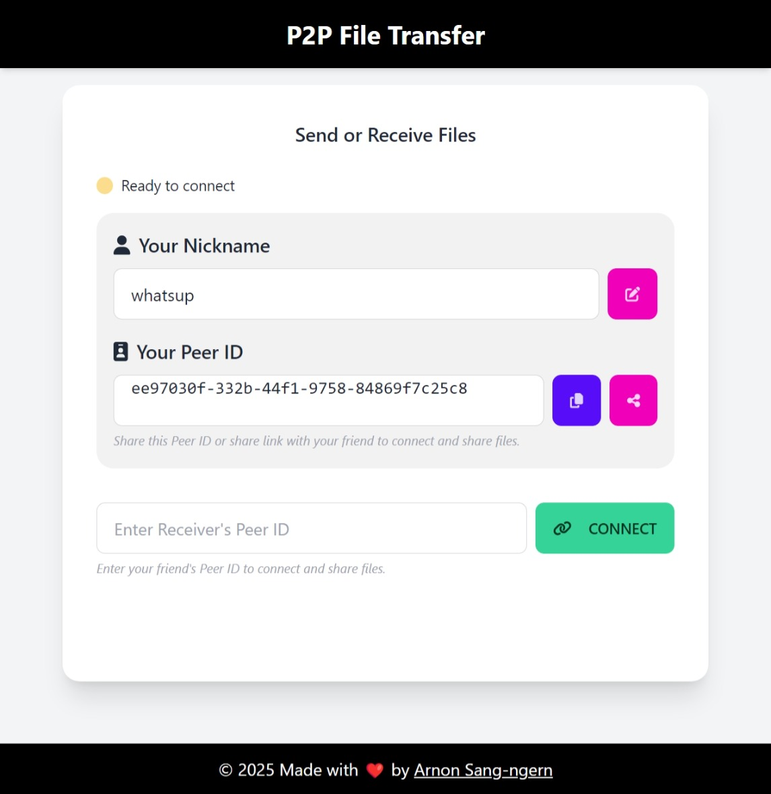

# Simple P2P File Transfer


Simple P2P File Transfer is a single file html with peer.js that allows secure and direct file sharing between peers without relying on centralized servers. It leverages modern web technologies to deliver a seamless file transfer experience.



## Live Demo
[p2pfile.iamickdev.com](https://p2pfile.iamickdev.com/)

## About

This project is designed to provide an easy-to-use interface for sending and receiving files using peer-to-peer (P2P) connections. Built with Single HTML File, JavaScript, and CSS libraries such as TailwindCSS and DaisyUI, it offers real-time progress updates and a responsive design.


## Features

- **Peer-to-Peer Connection:** Connect directly with peers for file transfers.
- **Real-Time Updates:** Monitor file transfer progress with a built-in progress bar.
- **Multiple File Support:** Choose and send multiple files at once.
- **Modern UI:** Clean and responsive design powered by TailwindCSS and DaisyUI.

## Installation

1. **Clone the Repository:**

   ```bash
   git clone https://github.com/arnonsang/p2p-file-transfer.git
   ```

2. **Navigate to the Project Directory:**

   ```bash
   cd p2p-file-transfer
   ```

3. **Open the Application:**

   Simply open the `index.html` file in your preferred web browser.

## Usage

1. Open the `index.html` file in your browser.
2. Your Peer ID will be generated automatically—copy it.
3. Share your Peer ID with a friend to establish a connection.
4. Select the files you want to transfer.
5. Enjoy secure and direct file sharing!


## License

[MIT](LICENSE)
